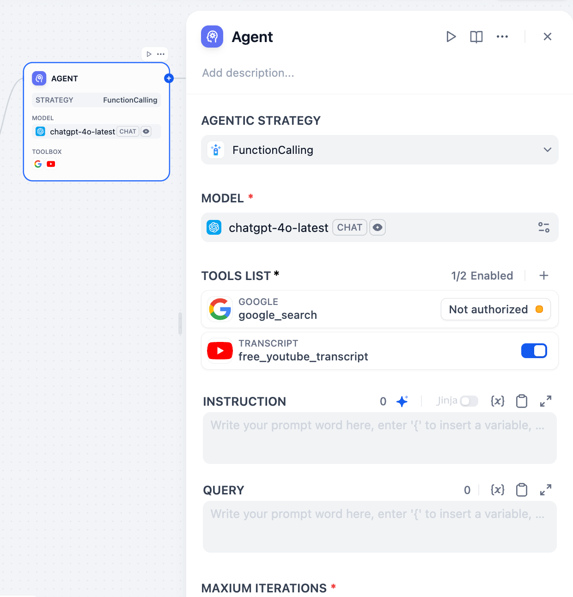
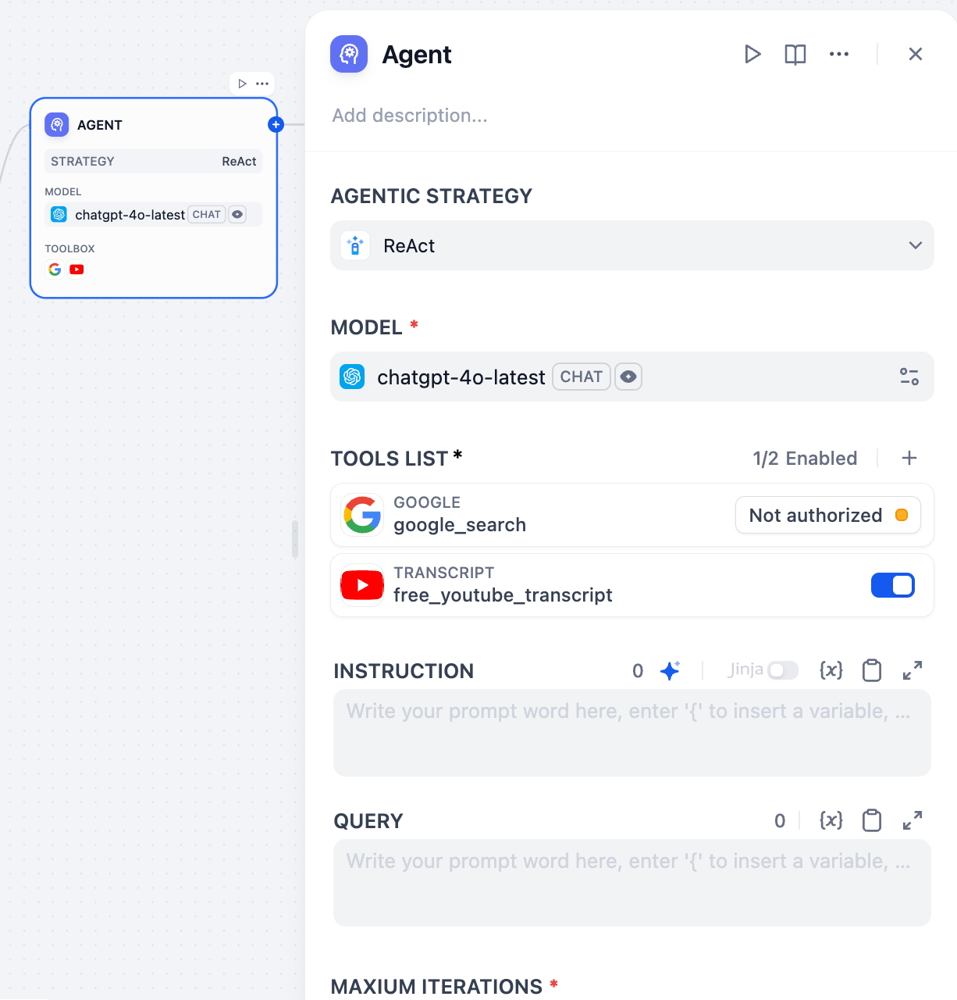

# 概述

Dify Chatflow/Workflow 中的 Agent 节点使大型语言模型 (LLM) 能够自主使用工具。该插件具有两种官方 Dify Agent 推理策略，使 LLM 能够在运行时动态选择和运行工具，以解决多步骤问题。

## 策略

### 1. 函数调用

函数调用将用户命令映射到特定的函数或工具。LLM 识别用户的意图，决定调用哪个函数，并提取所需的参数。这是一种调用外部功能的直接机制。

#### 优点：

- **精确：** 直接为已定义的任务调用正确的工具，避免复杂的推理。
- **易于外部集成：** 将外部 API 和工具集成为可调用函数。
- **结构化输出：** 提供结构化的函数调用信息，便于处理。

### 2. ReAct (推理 + 行动)

ReAct 在 LLM 推理情况和采取行动之间交替进行。LLM 分析当前状态和目标，选择并使用一个工具，然后使用该工具的输出进行下一步的思考和行动。此循环重复进行，直到问题得到解决。

#### 优点：

- **利用外部信息：** 有效地使用外部工具收集模型自身无法处理的任务所需的信息。
- **可解释的推理：** 交织的推理和行动步骤允许对 Agent 的过程进行一定程度的跟踪。
- **广泛的适用性：** 适用于需要外部知识或特定操作的任务，例如问答、信息检索和任务执行。
